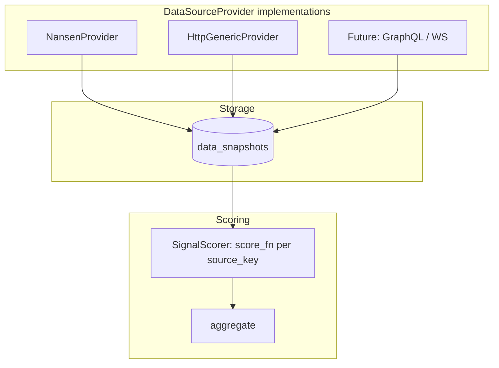
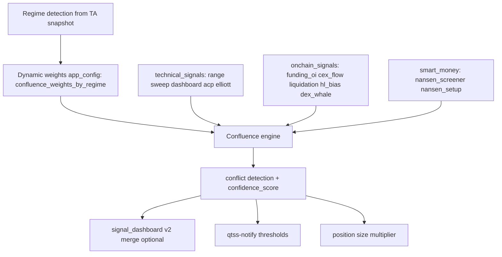

# Plan — Market data ingestion, confluence, notifications (English identifiers)

This document extends the product roadmap: **multi-source market context**, **confluence scoring**, **Telegram (and other) notifications** for setups and open positions. It incorporates the **seven signal source categories** discussed in chat (Mar 28) and the **latency policy**: prefer **low-latency / exchange-direct** feeds over delayed free tiers.

**Naming rule (mandatory for new work):** All new **Rust fields**, **JSON keys**, **DB columns**, and **API payloads** use **English `snake_case`**. UI copy may stay Turkish (or any locale) via i18n layers; the wire format stays English.

**Legacy note:** `SignalDashboardV1` in `qtss-chart-patterns` still exposes Turkish string *values* (e.g. `YUKARI`) and Turkish *field names* (`durum`, `yerel_trend`, …). Migrating to English keys is a **separate phased refactor** (see §7) so existing `analysis_snapshots` / web clients can migrate safely.

---

## 1. Signal sources — what we pull and why (mapped to QTSS)

Vendor policy is **authoritative** in §2 (what we **exclude**, what we **keep**, what is **complementary only**).

| Source category | Typical metrics | Free? | QTSS integration | Use in project |
|-----------------|-----------------|-------|------------------|----------------|
| **smart_money** | Labelled wallet flows, token screener rows | Paid (Nansen) | `nansen_snapshots`, `nansen_setup_*`, `data_snapshots` `nansen_token_screener` | Early positioning, token-level setups; **do not replace** with free on-chain labels alone |
| **cex_flow** | Exchange netflow, balances, capital flow | **Not** CQ free (see §2) | **Coinglass** netflow / balance via `external_fetch` (`coinglass_*` keys); **Binance FAPI** taker / funding as **real-time** CEX derivatives context | CEX-side pressure; CQ free tier is **out of scope** for automation |
| **whale_transfers** | Large transfers, whale perp exposure | **Not** Whale Alert free (see §2) | **Coinglass** whale / large-transfer style endpoints where available; **HL** `clearinghouseState` (known wallets) — *future* `DataSourceProvider`; Nansen row fields | Short-term pressure; prefer HL + Coinglass over delayed free REST |
| **dex_pressure** | Buy vs sell notional, swap counts | Graph / DEX APIs (real-time) | **Nansen** screener `buy_volume` / `sell_volume` in `signal_scorer`; **The Graph** / **DexScreener** / similar via `external_fetch` + scorer when stable URL exists | **DeFi Llama** only for **TVL trend** (§2), **not** primary DEX pressure |
| **hyperliquid** | Funding, OI, mark; whale positions | Yes (public `info`) | `metaAndAssetCtxs` → `data_snapshots`; `setup_scan_engine` enrich; *future* `clearinghouseState` for watchlist wallets | **Real-time** perp crowding; **keep** |
| **funding_oi** | Funding, OI, long/short, taker | Binance FAPI public + Coinglass (API key) | `binance_premium_*`, `binance_open_interest_*`, `binance_taker_*` via `external_fetch`; `qtss-binance` for signed/account paths | **Real-time** leverage heat; **keep** |
| **liquidations** | Liq clusters, directional liq | Coinglass (free tier quota) | `coinglass_liquidations_*` via `external_fetch` + `signal_scorer` | **Real-time** (~1–5s); mind monthly call budget on free tier |

**Combined read (conceptual):** For a symbol, join **technical** (`trading_range`, `signal_dashboard`, optional Elliott/ACP) with **context** (`nansen_setup_rows` when token matches, `data_snapshots` by `source_key`, HL enrich fields in `raw_metrics`). **Confluence** = weighted agreement / conflict detection (no tight coupling between collectors).

**Diagrams you shared** (unified trait + confluence): equivalent flows are captured below as **Mermaid** so they are readable without images.

---

## 2. Latency & vendor policy (“delayed out, real-time in”)

### 2.1 Do **not** integrate (project scope)

| Source | Why exclude | Use instead in QTSS |
|--------|-------------|---------------------|
| **CryptoQuant (free)** | ~1d resolution + block/label lag; safe poll ≥10 min; hourly only on paid plans | **Binance USDT-M FAPI** (public): funding, taker long/short, open interest — already wired via `external_fetch` / migrations `0023`–`0028`. **Coinglass** for exchange netflow / balance with API key in `headers_json`. |
| **Whale Alert (free)** | ~10 req/min + block lag; REST delays for large transfers | **Hyperliquid** public `info` (e.g. `clearinghouseState` for known addresses — *roadmap*). **Coinglass** whale / large-transfer style data where the API exposes it. **Arkham** (free tier) entity/wallet tracking — *optional future* HTTP row + scorer (no hard dependency). |

### 2.2 **Keep** — real-time or near–real-time

| Source | Latency (typ.) | Notes |
|--------|----------------|--------|
| **Binance Futures (FAPI)** | ~0s (REST); WS in worker for bars | Public endpoints; respect ~1200 req/min. Funding, OI, taker ratio used in confluence / `signal_scorer`. |
| **Hyperliquid** | ~0s | `metaAndAssetCtxs` (and future `clearinghouseState`); enable row `0026` when ready. |
| **Coinglass (free tier)** | ~1–5s | Funding, OI, liquidations, netflow; **monthly call budget** on free plan — tune `tick_secs` and enabled flags. |
| **Nansen** | ~1–10m (credits) | Smart-money / screener **unique** value; credit handling in worker / setup scan already. |

### 2.3 **Complementary only**

| Source | Role | Cadence |
|--------|------|---------|
| **DeFi Llama** | **TVL trend** indicator for protocol trust / regime context | **30m+** `tick_secs` acceptable; **do not** use as primary **DEX buy/sell pressure** (DEX volume there is too slow). |
| **DEX pressure (primary)** | Uniswap / Pancake / … | **The Graph** subgraphs, **DexScreener** / **Biruni**-class APIs, or pool-specific HTTP — add as `external_data_sources` + extend `signal_scorer` per `source_key`. |

### 2.4 Legacy swap table (short)

| Avoid for *active* signals | Preferred replacement |
|----------------------------|------------------------|
| CQ free | Binance FAPI + Coinglass |
| Whale Alert free | HL + Coinglass (+ optional Arkham later) |
| DeFi Llama as **primary** DEX pressure | Nansen DEX fields + Graph / DEX API |

**Nansen** stays on a **conscious tick** (e.g. 30m): fine for smart-money *context*, not for sub-second execution.

**Operator guide (env, API, troubleshooting):** [`docs/NANSEN_TOKEN_SCREENER.md`](./NANSEN_TOKEN_SCREENER.md).

**Example `external_data_sources` rows** (placeholders — verify URLs and add `headers_json` for Coinglass):

```sql
-- Illustrative only; validate URLs + Coinglass paths. Do NOT use CryptoQuant free tier for QTSS automation (§2.1).
INSERT INTO external_data_sources (key, method, url, body_json, tick_secs, description) VALUES
('coinglass_netflow_btc', 'GET',
 'https://open-api.coinglass.com/public/v2/exchange/netflow?symbol=BTC&ex=Binance',
 NULL, 300, 'BTC Binance netflow — Coinglass key in headers_json'),
('binance_taker_btcusdt', 'GET',
 'https://fapi.binance.com/futures/data/takerlongshortRatio?symbol=BTCUSDT&period=5m&limit=10',
 NULL, 60, 'Real-time taker ratio (preferred over delayed CQ free)'),
('coinglass_exchange_balance_btc', 'GET',
 'https://open-api.coinglass.com/public/v2/exchange/balance?symbol=BTC',
 NULL, 300, 'Exchange balance — whale / flow context; Coinglass key');
-- HL: metaAndAssetCtxs in 0026; clearinghouseState for known wallets — future row + scorer.
```

---

## 3. Unified data collection — `DataSourceProvider` trait (target architecture)

**Goal (matches your first diagram):** One **trait** for *how* data is fetched; **different** implementations for Nansen (credits, headers, errors), generic HTTP (`external_fetch`), and future GraphQL / WebSocket sources. The **scorer** dispatches on `source_key` and does not care which provider ran.

### 3.1 Trait contract (sketch — English names only)

```rust
// Implemented: `crates/qtss-worker/src/data_sources/provider.rs`
#[async_trait::async_trait]
pub trait DataSourceProvider: Send + Sync {
    /// Same as DB `source_key` (`&str` — HTTP rows use `external_data_sources.key`).
    fn source_key(&self) -> &str;

    /// Upserted to `data_snapshots` via `persist_fetch_to_data_snapshot`; HTTP status lives in `meta_json` (e.g. `http_status`).
    async fn fetch(&self) -> DataSourceFetchOk;
}

pub struct DataSourceFetchOk {
    pub request_json: serde_json::Value,
    pub response_json: Option<serde_json::Value>,
    pub meta_json: Option<serde_json::Value>,
    pub error: Option<String>,
}
```

**Implementations:**

| Type | Role | Backing code today |
|------|------|--------------------|
| `NansenTokenScreenerProvider` | Credits + `post_token_screener` | `nansen_engine.rs`, `qtss-nansen` |
| `HttpGenericProvider` | Config-driven GET/POST | `external_fetch_engine.rs`, `external_data_sources` |
| `BinanceFapiProvider` (optional) | Signed or public FAPI where needed | `qtss-binance` (future) |
| `GraphQlProvider` / `WsProvider` | Future | new impl, same trait |

**Worker registration:** a `Vec<Arc<dyn DataSourceProvider>>` or small registry; one supervisor loop calls `fetch` per provider on its schedule (reuse `tick_secs` from config / Nansen env).

### 3.2 Unified storage: `data_snapshots` for HTTP (+ `nansen_snapshots` for Nansen)

| Phase | Storage | Notes |
|-------|---------|--------|
| **Nansen** | `nansen_snapshots` | Token screener; ayrıca `data_snapshots` (`nansen_token_screener`) confluence için. |
| **Generic HTTP** | `data_snapshots` only | `external_data_snapshots` kaldırıldı (`migrations/0024_drop_external_data_snapshots.sql`). |



### 3.3 Adding a new API (3 steps)

1. **Implement** `DataSourceProvider` (or add a row for `HttpGenericProvider` only).
2. **Register** the provider in the worker registry (or insert `external_data_sources`).
3. **Register** a `score_fn` for that `source_key` in `SignalScorer` (or config-driven formula id).

---

## 4. Confluence architecture (regime weights + engine_analysis)

**Flow (matches your second diagram):** Regime comes from existing TA (today: `signal_dashboard` / `piyasa_modu` — map to **English** regime codes in confluence layer: `range`, `trend`, `breakout`, `uncertain`). Weights load from **`app_config`** (JSON). Three **input groups** feed the confluence engine; outputs go to `analysis_snapshots` (`engine_kind = "confluence"`), notify, and position sizing policy.



### 4.1 Example `app_config` value (English keys)

Config key suggestion: `confluence_weights_by_regime`.

```json
{
  "range":    { "technical": 0.50, "onchain": 0.35, "smart_money": 0.15 },
  "trend":    { "technical": 0.30, "onchain": 0.40, "smart_money": 0.30 },
  "breakout": { "technical": 0.40, "onchain": 0.45, "smart_money": 0.15 },
  "uncertain":{ "technical": 0.20, "onchain": 0.30, "smart_money": 0.50 }
}
```

**Regime mapping:** Implement a small function `fn map_market_mode_to_regime(legacy: &str) -> &'static str` translating current Turkish mode strings to the four English keys above (until `SignalDashboardV2` emits `market_mode` in English).

### 4.2 `engine_analysis` integration

After `trading_range` + `signal_dashboard` are computed for a symbol, run **confluence**:

1. Read latest `data_snapshots` rows (or legacy dual read) for relevant `source_key`s.
2. Resolve regime → weights from `app_config`.
3. Produce `confluence` JSON: `pillar_scores`, `composite_score`, `confidence_0_100`, `conflicts: [{ "code": "ta_long_vs_funding_crowded_long", "severity": "warn" }]`.
4. `upsert_analysis_snapshot(..., engine_kind = "confluence", ...)`.

**Conflict rule (example):** TA bias long + extreme positive funding + bearish CEX flow → lower `confidence_0_100` and expose `lot_scale` suggestion (advisory until execution policy consumes it).

**Implemented (worker confluence JSON):** `schema_version` **2** adds advisory **`lot_scale_hint`** in **[0.5, 1.0]**, derived from conflict count (`1 - 0.12 * n`, clamped). **`conflicts`** entries use English **`code`** / **`severity`**; additional codes include e.g. `breakout_regime_strong_onchain_bias`, `strong_ta_thin_smart_money`, `technical_vs_weighted_composite_opposed` alongside TA vs funding / onchain pairs. Web **Motor** and **Bağlam** drawers surface `lot_scale_hint` and a short conflict summary.

**Regime / TA alignment (v2):** When `signal_dashboard` embeds **`signal_dashboard_v2`** with `schema_version` **3**, confluence uses **`market_mode`** (English: `range`, `breakout`, `trend`, `uncertain`) for **`regime`** / `app_config` weights, and **`status`** + **`position_strength_10`** for the technical pillar; legacy Turkish `piyasa_modu` / `durum` remain the fallback (`crates/qtss-worker/src/confluence.rs`).

**`data_sources_considered`:** Confluence payload lists concrete keys read for pillars — `nansen_token_screener` and `binance_taker_{base}usdt` (not a `*` placeholder). Additional keys when those pillars consume them (e.g. HL). Web **Motor** ve **Bağlam** confluence özetlerinde `formatConfluenceExtras` → `sources …` satırı.

---

## 5. Confluence vs Elliott / ACP / Trading Range

| Regime (from `market_mode` / TR logic) | Primary engine | Secondary | External context |
|----------------------------------------|----------------|-----------|------------------|
| **range** | `trading_range` + sweeps | ACP channel break confirmation | Funding / liq as caution |
| **breakout** (`KOPUS` equivalent) | Sweep signals | ACP | HL funding extreme → fade or size down |
| **trend** | Trend structure + optional Elliott impulse | — | OI + price agreement → healthy trend |
| **uncertain** | Lower TA weight | — | Nansen + derivatives snapshots weigh more |

**Rule:** modules **validate** each other; they should not call each other deeply. Emit **conflict flags** (e.g. `ta_direction` vs `derivatives_crowded_long`) in `confluence` payload.

---

## 6. Implementation phases (English JSON / columns)

### Phase A — Data plane (mostly config)

- Register `external_data_sources` rows (ops API or SQL): e.g. `hl_meta_asset_ctxs`, `binance_btc_taker_ratio`, `coinglass_btc_netflow` (exact URLs + `headers_json` for Coinglass API key).
- **`source_key` rehberi:** [`docs/DATA_SOURCES_AND_SOURCE_KEYS.md`](./DATA_SOURCES_AND_SOURCE_KEYS.md) — `snake_case`, bilinen anahtarlar, yeni kaynak adımları.
- Seed: `migrations/0026_external_source_hl_meta_asset_ctxs.sql` — Hyperliquid `metaAndAssetCtxs` (varsayılan **kapalı**); `migrations/0025_confluence_weights_app_config.sql` — `confluence_weights_by_regime` varsayılan ağırlıklar (`ON CONFLICT DO NOTHING`).

### Phase B — Persistence for derived scores

- **Implemented:** `migrations/0027_market_confluence_snapshots.sql` — append-only rows per `engine_symbol_id` with `scores_json`, `conflicts_json`, `regime`, `composite_score`, `confidence_0_100`.
- **Implemented:** `migrations/0029_market_confluence_payload_column.sql` — `confluence_payload_json` (full confluence engine payload at compute time for history / UI without joining `analysis_snapshots`).
- Worker: `insert_market_confluence_snapshot` after each successful confluence upsert (`crates/qtss-worker/src/confluence.rs`); failures logged only.
- API: `GET /api/v1/analysis/market-confluence/history` — `engine_symbol_id` **or** `symbol` (+ optional `interval` / `exchange` / `segment` like `market-context/latest`) + `limit` — `crates/qtss-api/src/routes/analysis.rs`; storage: `list_market_confluence_snapshots_for_symbol`.

### Phase C — API

- **`GET /api/v1/analysis/market-context/latest`** — `symbol` (required); optional `interval`, `exchange`, `segment` to pick one `engine_symbols` row. Response (English keys): `technical.signal_dashboard`, `technical.trading_range`, `confluence`, `context_data_snapshots` (Nansen `nansen_token_screener` + `binance_taker_{base}usdt` when present).
- **`GET /api/v1/analysis/market-context/summary`** — optional `exchange`, `segment`, `symbol`, `enabled_only`, `limit`: motor hedefleri + kısa TA / confluence alanları (web **Bağlam** özet tablosu).
- Daha geniş tenant / strateji / tarih filtreleri — future.
- Reuse dashboard RBAC patterns (`require_dashboard_roles`).

### Phase D — Notifications

- **Setup card (partial):** after successful `nansen_setup` run, if `QTSS_NOTIFY_SETUP_ENABLED` and any ranked row passes `QTSS_NOTIFY_SETUP_MIN_SCORE` + `QTSS_NOTIFY_SETUP_MIN_PROBABILITY` → one summary `Notification` (Turkish body; `run_id` in title). `crates/qtss-worker/src/setup_scan_engine.rs` — `maybe_notify_nansen_setup_run`.
- **Live fills (implemented):** `crates/qtss-worker/src/live_position_notify.rs` — polls `exchange_orders` for rows **created after** worker baseline with `venue_response` indicating `FILLED` / `PARTIALLY_FILLED` or `executedQty` > 0; env `QTSS_NOTIFY_LIVE_POSITION_ENABLED`, `QTSS_NOTIFY_LIVE_POSITION_CHANNELS`, `QTSS_NOTIFY_LIVE_TICK_SECS` (default 45s). **Not** a full position ledger (avg entry, SL/TP) — that remains `open_positions` / reconcile follow-up.
- **MVP (dry):** `paper_fill_notify.rs` — `QTSS_NOTIFY_PAPER_POSITION_*` / legacy `QTSS_NOTIFY_POSITION_*`, `QTSS_NOTIFY_POSITION_TICK_SECS`.

Env: `QTSS_NOTIFY_SETUP_*` + paper + **live** vars (see `.env.example`).

### Phase E — Web dashboard

- **Partial:** drawer tab **Bağlam** (`market_context`) — `market-context/latest`, **`market-context/summary`**, `engine/confluence/latest`, `data-snapshots`, **`GET …/external-fetch/sources`** (harici HTTP tanım listesi); `web/src/App.tsx` + `client.ts` (`fetchMarketContextLatest`, `fetchMarketContextSummary`, `fetchConfluenceSnapshotsLatest`, `fetchExternalFetchSources` — confluence 404 / harici uç 404’te boş liste; `data-snapshots` 404 → []). Ayarlar araması: `bağlam`, `confluence`, `f7`, `snapshot`, `source_key`, `external-fetch`, …; intro’da kök `.env.example`, `DATA_SOURCES_AND_SOURCE_KEYS.md`, `QTSS_CONFLUENCE_ENGINE` notu.
- Motor **Range / Paper (F4)** kartında **komisyon özeti (F5 GUI)** — `fetchBinanceCommissionDefaults` (panel yenileme), `fetchBinanceCommissionAccount` (düğme; `exchange_accounts`); bkz. `SPEC_EXECUTION_RANGE_SIGNALS_UI.md` §7.1.
- Signal card: Motor sekmesinde sinyal tablosu — satır etiketleri Türkçe; değerler **`signal_dashboard_v2`** (`schema_version` 3) varsa oradan, yoksa v1’den; v2 için **Wire (EN)** `<details>` (`web/src/lib/signalDashboardPayload.ts`, `App.tsx`).

### Phase F — `SignalDashboardV2` (refactor)

- **Partial (dual-write):** `signal_dashboard` JSON içinde Türkçe v1 alanları **aynı kalır** (`schema_version: 2` v1 struct’ta); ek olarak **`signal_dashboard_v2`** nesnesi (`schema_version: 3`, İngilizce `snake_case` anahtarlar) — `crates/qtss-chart-patterns/src/dashboard_v2_envelope.rs` (`SignalDashboardV2Envelope`, `signal_dashboard_v2_envelope_from_v1`); worker `enrich_dashboard_payload` (`engine_analysis.rs`) ile yazılır.
- **Sonraki:** Kalan tüketiciler + v1 kaldırma (deprecation) ayrı faz. **Yapıldı (kısmen):** Motor sinyal tablosu + Wire (EN); Bağlam «Tek hedef özeti» TA; **`GET …/market-context/summary`** `ta_durum` / `ta_piyasa_modu` — `signal_dashboard_v2` (`schema_version` 3) `status` / `market_mode` önceliği (`analysis.rs` `signal_dashboard_ta_brief`, `App.tsx`).

### Phase G — `DataSourceProvider` + optional `data_snapshots` migration

- **Done:** `DataSourceProvider`, `DataSourceFetchOk` (includes `fetch_duration_ms` → merged into persisted `meta_json` as `qtss_fetch_duration_ms`), `HttpGenericProvider`, `persist_fetch_to_data_snapshot` (`persist.rs` merges duration), `external_fetch_loop`.
- **Done:** `NansenTokenScreenerProvider` + `nansen_persist` — `nansen_engine` calls `fetch` then dual-write; `registry.rs` exports `REGISTERED_DATA_SOURCES` for documentation.
- **Later:** HL `clearinghouseState` provider (watchlist wallets); GraphQL provider for The Graph; optional Arkham HTTP row.
- `external_data_snapshots` removed; HTTP ham yanıt yalnız `data_snapshots`.
- **Done:** `SignalScorer` (`signal_scorer.rs`) dispatches by `source_key` for confluence.

---

## 7. Chat / diagram recap

- **Unified collection diagram:** §3 — `DataSourceProvider`, unified `data_snapshots` target, scorer dispatch by `source_key`.
- **Confluence diagram:** §4 — regime → `app_config` weights → three pillars → engine → `signal_dashboard` v2 / notify / position sizing.
- **Latency / vendor policy:** §2.1–2.4 — CQ free & Whale Alert free **out**; DeFi Llama **TVL only**; Binance FAPI + Coinglass + HL + Nansen **in**.
- **Module matrix:** §5 — TR/ACP/Elliott vs on-chain / smart money by regime.

---

## 8. Traceability

| Artifact | Location |
|----------|----------|
| Generic HTTP fetch | `migrations/0021_external_data_fetch.sql` (kaynak tablo), `migrations/0024_drop_external_data_snapshots.sql`, `migrations/0022_data_snapshots_confluence.sql`, `migrations/0023_external_data_sources_seed_f7.sql`, `migrations/0026_external_source_hl_meta_asset_ctxs.sql` (HL, kapalı), `crates/qtss-worker/src/external_fetch_engine.rs`, `crates/qtss-api/src/routes/external_fetch.rs` → okuma `data_snapshots` |
| `source_key` adlandırma | [`docs/DATA_SOURCES_AND_SOURCE_KEYS.md`](./DATA_SOURCES_AND_SOURCE_KEYS.md) |
| Confluence varsayılan ağırlıklar | `migrations/0025_confluence_weights_app_config.sql` → `app_config.confluence_weights_by_regime` |
| Confluence + v2 TA | `crates/qtss-worker/src/confluence.rs` (`map_market_mode_to_regime`, `effective_market_mode_label`, `technical_pillar_score`) |
| Market context (merged read) | `GET /api/v1/analysis/market-context/latest` — `crates/qtss-api/src/routes/analysis.rs`; `list_engine_symbols_matching` — `crates/qtss-storage/src/engine_analysis.rs` |
| Market context (filtreli özet) | `GET /api/v1/analysis/market-context/summary` — `analysis.rs`; `list_market_context_summaries` — `engine_analysis.rs`; web **Bağlam** “Motor hedefleri (filtreli özet)” |
| Confluence score history (Phase B) | `migrations/0027_*`, `0029_*` (`confluence_payload_json`), `market_confluence_snapshots.rs`, `GET /api/v1/analysis/market-confluence/history` (`engine_symbol_id` or `symbol`) — `analysis.rs` |
| Live fill notify (Phase D) | `live_position_notify.rs`, `exchange_orders::list_filled_orders_created_after`, env `QTSS_NOTIFY_LIVE_*` |
| Web “Bağlam” sekmesi | `web/src/App.tsx` (`market_context`), `web/src/api/client.ts` (`fetchMarketContextLatest`, `fetchMarketContextSummary`, `fetchConfluenceSnapshotsLatest`, `fetchDataSnapshots`, `fetchExternalFetchSources`) |
| Web Motor komisyon (F5 GUI) | `web/src/App.tsx` (F4 kartı altında), `fetchBinanceCommissionDefaults` / `fetchBinanceCommissionAccount` — `SPEC_EXECUTION_RANGE_SIGNALS_UI.md` §7.1 |
| `DataSourceProvider` (Phase G) | `crates/qtss-worker/src/data_sources/` — `provider.rs`, `http_generic.rs`, `nansen_token_screener_provider.rs`, `nansen_persist.rs`, `persist.rs`, `registry.rs` |
| Signal scoring by `source_key` | `crates/qtss-worker/src/signal_scorer.rs` (Binance premium/OI/taker, Nansen depth+DEX, HL funding, Coinglass parsers) |
| Nansen token screener (rehber) | [`docs/NANSEN_TOKEN_SCREENER.md`](./NANSEN_TOKEN_SCREENER.md) |
| Nansen worker + HTTP client | `crates/qtss-worker/src/nansen_engine.rs`, `crates/qtss-nansen/src/lib.rs` (`POST …/api/v1/token-screener`) |
| Nansen dynamic body | `crates/qtss-worker/src/nansen_query.rs`, `app_config` key `nansen_screener_request` (öncelik: config → `NANSEN_TOKEN_SCREENER_REQUEST_JSON` → default) |
| HL enrich in setups | `crates/qtss-worker/src/setup_scan_engine.rs` |
| Current TA dashboard | `crates/qtss-chart-patterns/src/dashboard_v1.rs`, `dashboard_v2_envelope.rs`, `engine_analysis.rs` (`signal_dashboard_v2` dual-write) |
| Notifications | `crates/qtss-notify`, `QTSS_NOTIFY_*`; setup özeti `setup_scan_engine.rs` (`QTSS_NOTIFY_SETUP_*`); dry dolum `paper_fill_notify.rs` (`QTSS_NOTIFY_PAPER_POSITION_*`, `QTSS_NOTIFY_POSITION_TICK_SECS`) |
| Execution / range spec | `docs/SPEC_EXECUTION_RANGE_SIGNALS_UI.md` (F7 row) |

---

*Plan version: 5 — Phase B `0029` full payload + history by `symbol`; Phase D live fill notify (`QTSS_NOTIFY_LIVE_*`); Phase G fetch duration meta + `REGISTERED_DATA_SOURCES`.*
